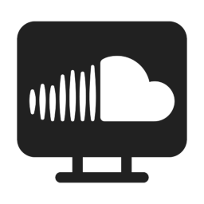

> **⚠️ Work in Progress**: This project is currently under active development. Some features may be incomplete or subject to change.


> ## Legal Notice
> This application is not affiliated with, endorsed by, or connected to SoundCloud in any way. SoundCloud is a trademark of SoundCloud Limited. This is an independent, unofficial desktop wrapper created by Oscar Barros-Nogueira. The SoundCloud icon and branding are property of SoundCloud Limited and used here for identification purposes only.

# SoundCloud Desktop


A simple desktop wrapper for SoundCloud with some quality-of-life improvements.

[](https://github.com/TheBanditOfRed/SoundCloud-Desktop/releases/latest)

## Features

- **Desktop app feel**: SoundCloud in its own window instead of a browser tab
- **No distractions**: Just SoundCloud, nothing else
- **System media controls**: Play/pause, next/previous track controls that work with:
  - Media keys on your keyboard
  - Windows taskbar thumbnail controls
  - macOS system media controls
  - Global keyboard shortcuts (F7/F8/F9)

More features are in development!

## Installation

### Prerequisites
- Node.js 18.0.0 or higher
- npm 9.0.0 or higher

### Run from source
```bash
git clone https://github.com/TheBanditOfRed/SoundCloud-Desktop.git
cd soundcloud-desktop
npm install
npm start
```

### Build from source

#### Windows
```bash
npm run build-win
```

#### macOS
```bash
npm run build-mac
```

#### Linux
```bash
npm run build-linux
```

>**Note**: Building from source for Windows is currently in a working state, though there are a few known issues with the current build (v1.1.0). The built application should function correctly for basic usage. Other platform builds have not been tested yet.

## Pre-built binaries

## That's it

It's literally just a better SoundCloud experience on desktop. Nothing fancy.

## Keyboard Shortcuts
|        Shortcut         |      Action      |
|:-----------------------:|:----------------:|
|  `F7`,`Media Previous`  |  Previous Track  |
| `F8`,`Media Play/Pause` | Play/Pause Track |
|    `F9`,`Media Next`    |    Next Track    |

## Known Issues
- Windows icon scaling looks bad

## License

The project is licensed under the BSD-3-Clause License, see the [LICENSE](LICENSE) file for details.

## Third-Party Assets
- Media control icons are sourced from [Microsoft's Fluent UI System Icons](https://github.com/microsoft/fluentui-system-icons), licensed under the MIT License.
